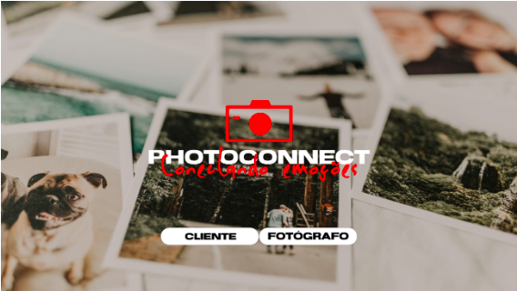

  <h1 >PhotoConnect</h1>
  <b>Projeto desenvolvido nas aulas de Projeto de Software 2 - FURB (Universidade Regional de Blumenau)</b>

## 💻🕑 Desenvolvido na data

1º - Foi feita a configuração do ambiente, conforme Konell orientou.

2º - Foi iniciado os mockups de telas, foi feito a tela inicial, tela inicial de cliente e fotografo

Feita a implementação das sessões, metodos post e put

Era previsto início da definição de telas do sistema. 

Realizada configuração e preparação do workspace. Instalação de ferramentas de desenvolvimento (Node.js, docker, recursos para desenvolvimento do node.js, Adobe XD para desenho das telas).

Após configuração do workspace, foi iniciado a etapa de projeção das telas utilizando o software instalado (Adobe XD).

